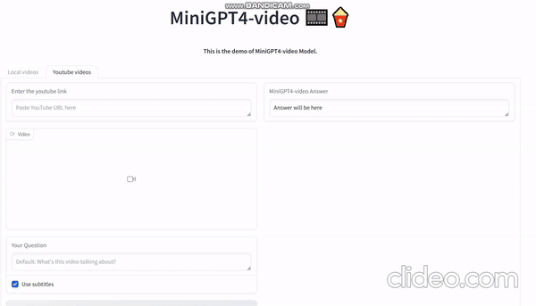
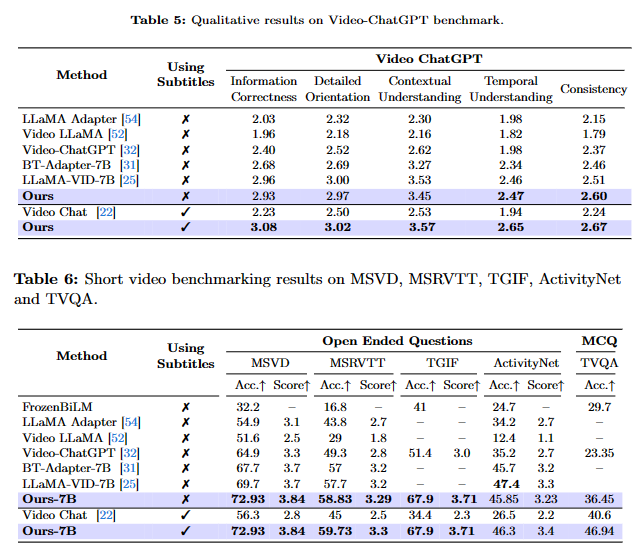

# MiniGPT4-Video: Advancing Multimodal LLMs for Video Understanding with Interleaved Visual-Textual Tokens
<!-- technical report link  -->
<!-- demo link  -->
<a href='https://vision-cair.github.io/MiniGPT4-video/'></a>
<a href='https://arxiv.org/abs/2404.03413'></a>
<a href='https://23e140b581cffa9101.gradio.live'></a>
<!-- <a href='https://github.com/Vision-CAIR/MiniGPT4-video'></a> -->


 
## Overview
This paper introduces MiniGPT4-Video, a multimodal Large Language Model (LLM) designed specifically for video understanding. The model is capable of processing both temporal visual and textual data, making it adept at understanding the complexities of videos.
Building upon the success of MiniGPT-v2, which excelled in translating visual features into the LLM space for single images and achieved impressive results on various image-text benchmarks, this paper extends the model's capabilities to process a sequence of frames, enabling it to comprehend videos.
MiniGPT4-video does not only consider visual content but also incorporates textual conversations, allowing the model to effectively answer queries involving both visual and text components. The proposed model outperforms existing state-of-the-art methods,  registering gains of 4.22%, 1.13%, 20.82%, and 13.1% on the MSVD, MSRVTT, TGIF, and TVQA benchmarks respectively.
During inference, a speech to text model such as Whisper model is utilized to generate subtitles for the video. Then, both the video and the subtitle are input to the MiniGPT4-Video model with the instruction and the model outputs the answer.


## :rocket: Demo
**1. Clone the repository** <br>
```bash
git clone https://github.com/Vision-CAIR/MiniGPT4-video.git
cd MiniGPT4-video
```

**2. Set up the environment** <br>
```bash
conda env create -f environment.yml
```
**3. Download the checkpoints**

| MiniGPT4-Video (Llama2 Chat 7B) | MiniGPT4-Video (Mistral 7B) |
:------------------------------------------------------------------------------------------------:|:----------------------------------------------------------------------------------------------:
| [Download](https://huggingface.co/Vision-CAIR/MiniGPT4-Video/blob/main/checkpoints/video_llama_checkpoint_last.pth) | [Download](https://huggingface.co/Vision-CAIR/MiniGPT4-Video/blob/main/checkpoints/video_mistral_checkpoint_last.pth) |

**4. Run the demo** <br>

```bash
# Llama2
python minigpt4_video_demo.py --ckpt path_to_video_checkpoint --cfg-path test_configs/llama2_test_config.yaml
# Mistral
python minigpt4_video_demo.py --ckpt path_to_video_checkpoint --cfg-path test_configs/mistral_test_config.yaml
```
### Inference
Do the previous steps and replace step 4 with this step 

```bash
# Llama2
python minigpt4_video_inference.py --ckpt path_to_video_checkpoint --cfg-path test_configs/llama2_test_config.yaml --video_path path_to_video --question "Your question here" 
# Mistral
python minigpt4_video_inference.py --ckpt path_to_video_checkpoint --cfg-path test_configs/mistral_test_config.yaml --video_path path_to_video --question "Your question here" 
```
## :fire: Training
### To customize MiniGPT4-Video for your own Video-text dataset 
<!-- point to file here Custom_training.md -->
You can find the steps to customize MiniGPT4-Video for your own video-text dataset in [Custom_training.md](Custom_training.md)
### Training datasets
After downloading the datasets below, **you should go to the datasets configuration folder here minigpt4/configs/datasets set the paths for each dataset there.**<br>
Image text training<br>
You can find the steps to download the datasets in [MiniGPT4](https://github.com/Vision-CAIR/MiniGPT-4/tree/main/dataset)<br>
+ LAION <br>
+ Conceptual Captions <br>
+ SBU <br>

Video text training:<br>

+ [CMD](https://www.robots.ox.ac.uk/~vgg/data/condensed-movies/) <br>
+ [Webvid](https://github.com/m-bain/webvid/) <br> <!-- + [Webvid](https://huggingface.co/datasets/TempoFunk/webvid-10M?row=2) <br> -->
+ [Video Instructional Dataset 100K](https://huggingface.co/datasets/MBZUAI/VideoInstruct-100K) <br>

You can find the datasets annotation files for video_text datasets here [download](https://huggingface.co/Vision-CAIR/MiniGPT4-Video/tree/main/datasets/training_datasets) <br>


### Model training: 
You can edit the number of gpus in the each script.sh below<br>
#### Stage 1 (image text pretraining)

You can directly download the pretrained MiniGPT4 [checkpoint](https://drive.google.com/file/d/11nAPjEok8eAGGEG1N2vXo3kBLCg0WgUk/view?usp=sharing) aligned with Llama2. <br>

Or train by yourself:

```bash
# pretrain
# Llama2
torchrun --nproc-per-node NUM_GPU train.py --cfg-path train_configs/224_minigpt4_llama2_image.yaml
# Mistral
torchrun --nproc-per-node NUM_GPU train.py --cfg-path train_configs/224_minigpt4_mistral_image.yaml

# align
# To launch the second stage alignment, first specify the path to the checkpoint file trained in pretrain stage.
# Llama2
torchrun --nproc-per-node NUM_GPU train.py --cfg-path train_configs/224_minigpt4_llama2_image_align.yaml
# Mistral
torchrun --nproc-per-node NUM_GPU train.py --cfg-path train_configs/224_minigpt4_mistral_image_align.yaml
```
You can download our trained weights for this stage from here [Llama2](https://huggingface.co/Vision-CAIR/MiniGPT4-Video/blob/main/checkpoints/image_llama2_checkpoint.pth) [Mistral](https://huggingface.co/Vision-CAIR/MiniGPT4-Video/blob/main/checkpoints/image_mistral_checkpoint.pth)<br>
#### Stage 2 (video captioning pretraining)

For **Llama2** <br>
set the cfg-path in the script to `train_configs/224_v2_llama2_video_stage_2.yaml` <br>
set the model name here `minigpt4/configs/datasets/cmd_video/default.yaml` and `minigpt4/configs/datasets/webvid/default.yaml` to llama2<br>
For **Mistral**<br> 
set the cfg-path in the script to `train_configs/224_v2_mistral_video_stage_2.yaml` <br>
set the model name here `minigpt4/configs/datasets/cmd_video/default.yaml` and `minigpt4/configs/datasets/webvid/default.yaml` to mistral<br>

```bash
bash jobs_video/train/stage_2.sh
```
You can download our trained weights for this stage from here [Llama2](https://huggingface.co/Vision-CAIR/MiniGPT4-Video/blob/main/checkpoints/video_captioning_llama_checkpoint_last.pth) [Mistral](https://huggingface.co/Vision-CAIR/MiniGPT4-Video/blob/main/checkpoints/video_captioning_mistral_checkpoint_last.pth)<br>

#### Stage 3 (video Instruction finetuning)

For **Llama2** <br>
set the cfg-path in the script to `train_configs/224_v2_llama2_video_stage_3.yaml` <br>
set the model name here `minigpt4/configs/datasets/video_chatgpt/default.yaml` to llama2<br>

For **Mistral**<br> 
set the cfg-path in the script to `train_configs/224_v2_mistral_video_stage_3.yaml` <br>
set the model name here `minigpt4/configs/datasets/video_chatgpt/default.yaml` to mistral<br>

```bash
bash jobs_video/train/stage_3.sh
```
You can download our trained weights for this stage from here [Llama2](https://huggingface.co/Vision-CAIR/MiniGPT4-Video/blob/main/checkpoints/video_llama_checkpoint_last.pth) [Mistral](https://huggingface.co/Vision-CAIR/MiniGPT4-Video/blob/main/checkpoints/video_mistral_checkpoint_last.pth)<br>

## :zap: Evaluation
To reproduce the results use the best checkpoints for each model <br>
[Llama2](https://huggingface.co/Vision-CAIR/MiniGPT4-Video/blob/main/checkpoints/video_captioning_llama_checkpoint_best.pth) [Mistral](https://huggingface.co/Vision-CAIR/MiniGPT4-Video/blob/main/checkpoints/video_captioning_mistral_checkpoint_best.pth)<br>
We used the same evaluation as [Video-ChatGPT](https://mbzuai-oryx.github.io/Video-ChatGPT/)<br>
<!--  -->

|Method| Using Subtitles | Information Correctness | Detailed Orientation | Contextual Understanding | Temporal Understanding | Consistency |
|:--------------------:|:----:|:------------------------:|:---------------------:|:-------------------------:|:-----------------------:|:------------:|
| LLaMA Adapter | :x:| 2.03 | 2.32| 2.30| 1.98| 2.15 |
| Video LLaMA| :x:| 1.96 | 2.18| 2.16| 1.82| 1.79 |
| Video Chat| :x:| 2.23 | 2.50| 2.53| 1.94| 2.24 |
| Video-ChatGPT | :x:| 2.40 | 2.52| 2.62| 1.98| 2.37 |
| BT-Adapter-7B | :x:| 2.68 | 2.69| 3.27| 2.34| 2.46 |
| LLaMA-VID-7B| :x:| 2.96 | 3.00| 3.53| 2.46| 2.51 |
| **Ours-7B Llama2**| :x:| 2.93 | 2.97| 3.45| **2.47**| **2.60**|
| **Ours-7B Llama2**| :white_check_mark:| **3.08** | **3.02**| **3.57**| **2.65**| **2.67**|
| **Ours-7B Mistral** | :x:| 2.83|2.52 |3.01 |2.32 |2.40 |
| **Ours-7B Mistral**| :white_check_mark:| 2.91 | 2.57| 3.11|2.33 | 2.39|


|Method| Using Subtitles | MSVD Acc.↑ | MSVD Score↑ | MSRVTT Acc.↑ | MSRVTT Score↑ | TGIF Acc.↑ | TGIF Score↑ | ActivityNet Acc.↑ | ActivityNet Score↑ | TVQA Acc.↑ |
|:---------------------------------------:|:----------------:|:-----------:|:------------:|:--------------:|:---------------:|:-----------:|:------------:|:-------------------:|:--------------------:|:------------:|
| FrozenBiLM|:x:|32.2| --|16.8 |--| 41 |-- |24.7|--|29.7 |
| LLaMA Adapter|:x:|54.9| 3.1 |43.8 |2.7| -- |-- |34.2| 2.7| --|
| Video LLaMA|:x:|51.6| 2.5 |29|1.8| -- |-- |12.4| 1.1| --|
| Video Chat|:x:|56.3| 2.8 |45|2.5|34.4| 2.3 |26.5| 2.2|--|
| Video-ChatGPT|:x:|64.9| 3.3 |49.3 |2.8|51.4| 3.0 |35.2| 2.7|23.35|
| BT-Adapter-7B|:x:|67.7| 3.7 |57|3.2| -- |-- |45.7| 3.2| --|
| LLaMA-VID-7B |:x:|69.7| 3.7 |57.7 |3.2| -- |-- |**47.4**| **3.3**| --|
| **Ours-7B LLama2**|:x:|72.93|3.84|58.83|3.29|67.9|3.71| 45.85 |3.23|36.45|
| **Ours-7B Llama2**|:white_check_mark:|72.93|3.84|**59.73**|**3.3** |67.9|3.71| 46.3|3.4 |46.94|
| **Ours-7B Mistral**|:x:|**73.92**|**4.06**|58.26|3.52|**72.22**|**4.08**|44.25 |3.35|33.90|
| **Ours-7B Mistral**|:white_check_mark:|**73.92**|**4.06**|58.68|3.53 |**72.22**|**4.08**| 44.38|3.36 |**54.21** |

### Download datasets for evaluation
+ [MSVD](https://www.cs.utexas.edu/users/ml/clamp/videoDescription/) <br>
+ [MSRVTT](https://cove.thecvf.com/datasets/839) <br>
+ [TGIF](https://github.com/YunseokJANG/tgif-qa/blob/master/dataset/README.md) <br>
+ [ActivityNet](https://mbzuaiac-my.sharepoint.com/:u:/g/personal/hanoona_bangalath_mbzuai_ac_ae/ESa302OCJMNHsMk7wuBbQc8BZH5CqlcdCWiSpXynQZDfAQ?e=CrOPbm) <br>
+ [TVQA](https://tvqa.cs.unc.edu/) <br>
+ [Video-ChatGPT benchmark](https://mbzuai-oryx.github.io/Video-ChatGPT/) <br>

You can find the evaluation datasets annotation files [download](https://huggingface.co/Vision-CAIR/MiniGPT4-Video/tree/main/datasets/evaluation_datasets) <br>

### Run evaluation script
Set the each evaluation script parameters to include the path to the checkpoints, the dataset name and whether to use subtitles or not <br> 

```bash
# Llama2
bash jobs_video/eval/llama2_evaluation.sh
# Mistral
bash jobs_video/eval/mistral_evalualtion.sh
```
Then Use GPT3.5 turbo to compare the predictions with the ground truth and generate the accuracy and scores <br>
Set these variables in both evaluate_benchmark.sh and evaluate_zeroshot.sh <br>
```bash
PRED="path_to_predictions"
OUTPUT_DIR="path_to_output_dir"
API_KEY="openAI_key"
NUM_TASKS=128
```
Then to evaluate [Video-ChatGPT benchmark] run the following script <br>
```bash
bash test_benchmark/quantitative_evaluation/evaluate_benchmark.sh
```
To evaluate open ended questions run the following script <br>
```bash
bash test_benchmark/quantitative_evaluation/evaluate_zeroshot.sh
```

If you're using MiniGPT4-Video in your research or applications, please cite using this BibTeX:
```
@article{ataallah2024minigpt4,
  title={MiniGPT4-Video: Advancing Multimodal LLMs for Video Understanding with Interleaved Visual-Textual Tokens},
  author={Ataallah, Kirolos and Shen, Xiaoqian and Abdelrahman, Eslam and Sleiman, Essam and Zhu, Deyao and Ding, Jian and Elhoseiny, Mohamed},
  journal={arXiv preprint arXiv:2404.03413},
  year={2024}
}
```

## Acknowledgements
[MiniGPT4](https://github.com/Vision-CAIR/MiniGPT-4) <br>
[Video-ChatGPT](https://mbzuai-oryx.github.io/Video-ChatGPT)

## License
This repository is under [BSD 3-Clause License](LICENSE.md).
Many codes are based on [MiniGPT4](https://github.com/Vision-CAIR/MiniGPT-4).
