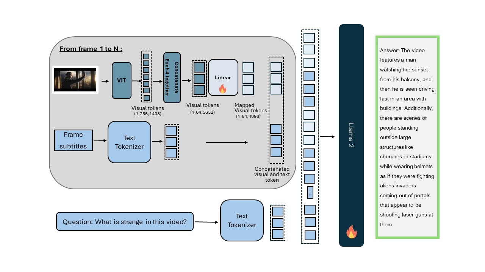

# MiniGPT-Video
<!-- technical report link  -->
<!-- demo link  -->
## Overview
MiniGPT4-Video is an innovative model designed for video question answering, adept at comprehending both visual stimuli and conversational content within the video domain. This model undergoes training on extensive video-text and image-text corpora. The architectural framework of MiniGPT4-Video is visually depicted in the accompanying figure. During the frame encoding phase, EVA-CLIP is employed, incorporating a projection layer to facilitate the mapping of visual features onto the textual domain of the Large Language Model (LLM). Similar to MiniGPT-v2, we condense each group of four adjacent visual tokens into a singular token, resulting in a 75% reduction in token count per image, from 256 to 64. Throughout the training process, the LLM assimilates the fusion of video frame features with subtitles, thereby comprehending the temporal dynamics inherent within the video content. During inference, the Whisper model is utilized to generate subtitles for the video. Then, both the video and the subtitle are input to the MiniGPT4-Video model.


## :rocket: Demo
**1. Clone the repository** <br>
```bash
git clone https://github.com/Vision-CAIR/MiniGPT4-video.git
```
**2. Set up the environment** <br>
```bash
conda env create -f environment.yml
```
**3. Download the checkpoints**

| MiniGPT-Video (Llama2 Chat 7B) | MiniGPT-Video (Mistral 7B) |
:------------------------------------------------------------------------------------------------:|:----------------------------------------------------------------------------------------------:
| [Download](https://huggingface.co/Vision-CAIR/MiniGPT4-Video/blob/main/checkpoints/video_llama_checkpoint_last.pth) | [Download](https://huggingface.co/Vision-CAIR/MiniGPT4-Video/blob/main/checkpoints/video_mistral_checkpoint_best.pth) |

**4. Run the demo** <br>

```bash
# Llama2
python minigpt4_video_demo.py --ckpt path_to_video_checkpoint --cfg-path test_configs/llama2_test_config.yaml
# Mistral
python minigpt4_video_demo.py --ckpt path_to_video_checkpoint --cfg-path test_configs/mistral_test_config.yaml
```
### Inference
Do the previous steps and replace step 4 with this step 

```bash
# Llama2
python minigpt4_video_inference.py --ckpt path_to_video_checkpoint --cfg-path test_configs/llama2_test_config.yaml --video_path path_to_video --question "Your question here" 
# Mistral
python minigpt4_video_inference.py --ckpt path_to_video_checkpoint --cfg-path test_configs/mistral_test_config.yaml --video_path path_to_video --question "Your question here" 
```
## :fire: Training

### Training datasets

Image text training<br>
+ LAION <br>
+ Conceptual Captions <br>
+ SBU <br>

Video text training:<br>

+ [CMD](https://www.robots.ox.ac.uk/~vgg/data/condensed-movies/) <br>
+ Webvid <br> <!-- -[Webvid](https://huggingface.co/datasets/TempoFunk/webvid-10M?row=2)  -->
+ [Video Instructional Dataset 100K](https://huggingface.co/datasets/MBZUAI/VideoInstruct-100K) <br>

You can find the datasets annotation files [download](https://huggingface.co/Vision-CAIR/MiniGPT4-Video/tree/main/datasets/training_datasets) <br>

### Model training: 
You can edit the number of gpus in the script.sh below<br>
#### Stage 1 (image text pretraining)

Same as [MiniGPT4](https://github.com/Vision-CAIR/MiniGPT-4), you can directly download the pretrained [checkpoint](https://drive.google.com/file/d/11nAPjEok8eAGGEG1N2vXo3kBLCg0WgUk/view?usp=sharing) aligned with Llama2.

```bash
# Llama2
torchrun --nproc-per-node NUM_GPU train.py --cfg-path 224_minigpt4_llama2_image.yaml
# Mistral
torchrun --nproc-per-node NUM_GPU train.py --cfg-path 224_minigpt4_mistral_image.yaml
```
You can download our trained weights for this stage from here [Llama2](https://huggingface.co/Vision-CAIR/MiniGPT4-Video/blob/main/checkpoints/image_llama2_checkpoint.pth) [Mistral](https://huggingface.co/Vision-CAIR/MiniGPT4-Video/blob/main/checkpoints/image_mistral_checkpoint.pth)<br>
#### Stage 2 (video captioning pretraining)

For **Llama2**, set the cfg-path in the script to train_configs/224_v2_llama2_video_stage_2.yaml <br>

For **Mistral**, set the cfg-path in the script to train_configs/224_v2_mistral_video_stage_2.yaml <br>

```bash
bash jobs_video/train/stage_2.sh
```
You can download our trained weights for this stage from here [Llama2](https://huggingface.co/Vision-CAIR/MiniGPT4-Video/blob/main/checkpoints/video_captioning_llama_checkpoint_last.pth) [Mistral](https://huggingface.co/Vision-CAIR/MiniGPT4-Video/blob/main/checkpoints/video_captioning_mistral_checkpoint_last.pth)<br>

#### Stage 3 (video Instruction finetuning)

For **Llama2**, set the cfg-path in the script to train_configs/224_v2_llama2_video_stage_3.yaml <br>

For **Mistral**, set the cfg-path in the script to train_configs/224_v2_mistral_video_stage_3.yaml <br>

```bash
bash jobs_video/train/stage_3.sh
```
You can download our trained weights for this stage from here [Llama2](https://huggingface.co/Vision-CAIR/MiniGPT4-Video/blob/main/checkpoints/video_llama_checkpoint_best.pth) [Mistral](https://huggingface.co/Vision-CAIR/MiniGPT4-Video/blob/main/checkpoints/video_mistral_checkpoint_best.pth)<br>

## :zap: Evaluation
We used the same evaluation as [Video-ChatGPT](https://mbzuai-oryx.github.io/Video-ChatGPT/)<br>


### Download datasets for evaluation
+ [MSVD](https://www.cs.utexas.edu/users/ml/clamp/videoDescription/) <br>
+ [MSRVTT](https://cove.thecvf.com/datasets/839) <br>
+ [TGIF](https://github.com/YunseokJANG/tgif-qa/blob/master/dataset/README.md) <br>
+ [ActivityNet](https://mbzuaiac-my.sharepoint.com/:u:/g/personal/hanoona_bangalath_mbzuai_ac_ae/ESa302OCJMNHsMk7wuBbQc8BZH5CqlcdCWiSpXynQZDfAQ?e=CrOPbm) <br>
+ [TVQA](https://tvqa.cs.unc.edu/) <br>
+ [Video-ChatGPT benchmark](https://mbzuai-oryx.github.io/Video-ChatGPT/) <br>

You can find the datasets annotation files [download](https://huggingface.co/Vision-CAIR/MiniGPT4-Video/tree/main/datasets/evaluation_datasets) <br>

### Run evaluation script
Edit the evaluation script to include the path to the checkpoints, the dataset name and whether to use subtitles or not <br> 

```bash
# Llama2
bash jobs_video/eval/llama2_evaluation.sh
# Mistral
bash jobs_video/eval/mistral_evalualtion.sh
```
Then Use GPT3.5 turbo to compare the predictions with the ground truth and generate the accuracy and scores <br>
Set these variables in the script <br>
```bash
PRED="path_to_predictions"<br>
OUTPUT_DIR="path_to_output_dir"<br>
API_KEY="openAI_key"<br>
NUM_TASKS=128<br>
```
Then to evaluate [Video-ChatGPT benchmark] run the following script <br>
```bash
bash test_benchmark/quantitative_evaluation/evaluate_benchmark.sh
```
To evaluate open ended questions run the following script <br>
```bash
bash test_benchmark/quantitative_evaluation/evaluate_zeroshot.sh
```
## Acknowledgements
[MiniGPT4](https://github.com/Vision-CAIR/MiniGPT-4/tree/main?tab=readme-ov-file)
[Video-ChatGPT](https://mbzuai-oryx.github.io/Video-ChatGPT/)

## License
